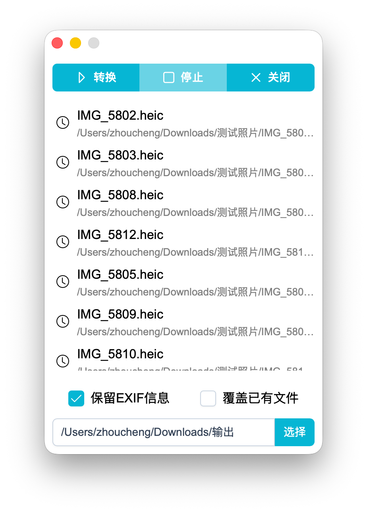

# HEIC Converter

**HEIC & HEIF图片 -> Jpeg转换工具**

支持的Windows系统: Windows7*~ & macOS

核心组件[在这里](https://github.com/Zhoucheng133/HEIC-Converter-Core)

*可能需要重新编译，本项目中Release里的版本是在Windows11上编译的

## 截图

## 在你的设备上配置HEIC Converter

### 准备工作

你需要在你的设备上安装:
- bun
- rust

### 打包

1. 前往[核心组件仓库](https://github.com/Zhoucheng133/HEIC-Converter-Core)生成可执行文件（内含编译方法）
2. 将其复制到`src-tauri/binaries`中，注意重命名为现有的命名，比如: macOS下应该叫`core-aarch64-apple-darwin`，Windows x64架构应该叫`core-x86_64-pc-windows-msvc.exe`，如果你的系统不是以上两种架构&系统，参见[Tauri官方文档](https://tauri.org.cn/develop/sidecar/)
3. 使用命令`bun run tauri build`打包App