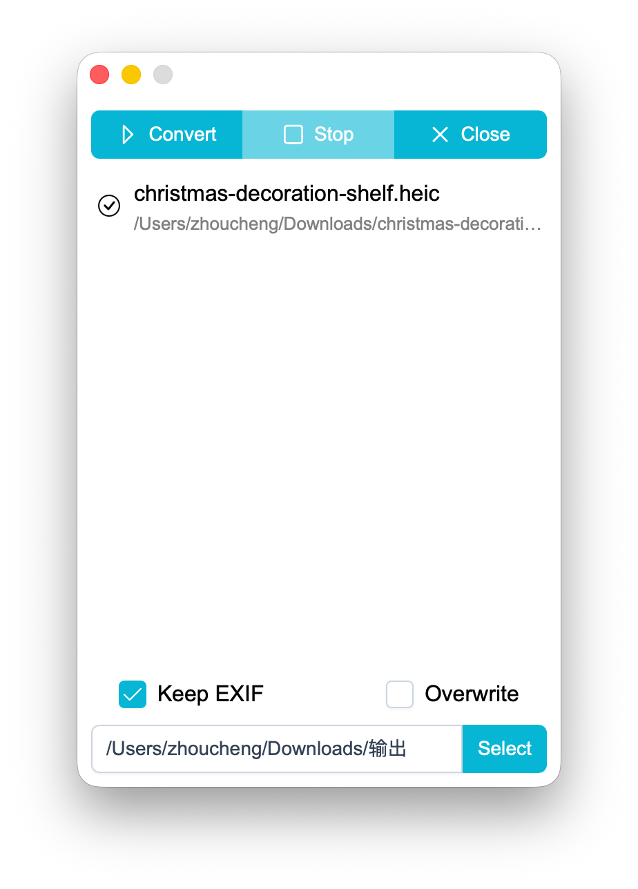

# HEIC Converter

Also available in English. Click [HERE](/documents/en.md) to view the English version of the README

## Introduction

 
`HEIC` & `HEIF` Image → `JPEG` Conversion Tool

Supports Windows and macOS  
Core component [available here](https://github.com/Zhoucheng133/HEIC-Converter-Core)

## Screenshots

## Set Up on Your Device

### Prerequisites

You need to install the following on your device:
- bun
- rust

### Build

1. Go to the [core component repository](https://github.com/Zhoucheng133/HEIC-Converter-Core) to generate the executable file (build instructions included)
2. Copy it into `src-tauri/binaries`, and make sure to rename it to match the existing naming convention.  
   For example:
   - On macOS: `core-aarch64-apple-darwin`  
   - On Windows x64: `core-x86_64-pc-windows-msvc.exe`  
   If your system or architecture is different from the above, refer to the [official Tauri documentation](https://tauri.org.cn/develop/sidecar/)
3. Use the command `bun run tauri build` to package the app
